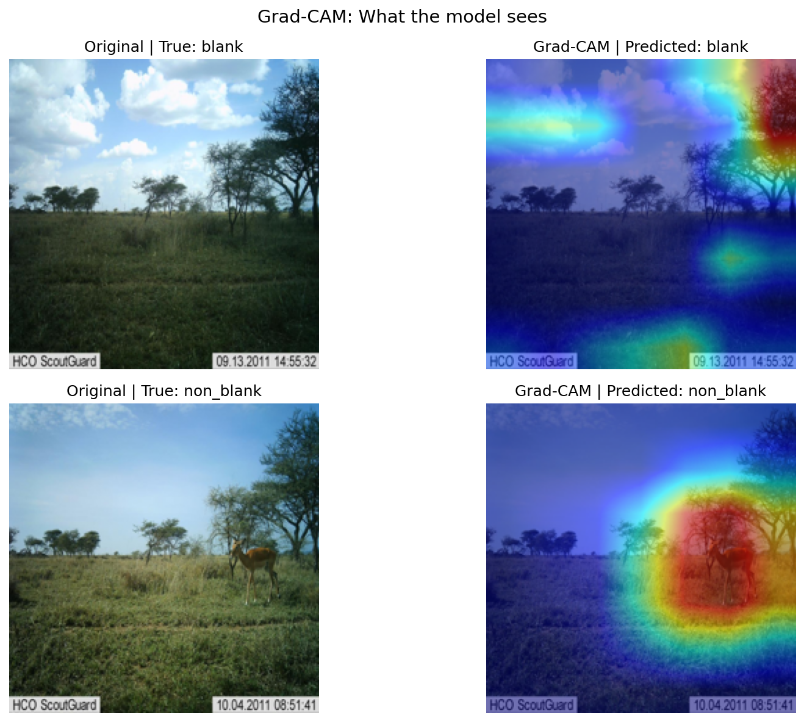

# Wildlife Camera Trap Detector

A deep learning project that classifies wildlife camera trap images as **blank** (no animal) or **non-blank** (animal present), with visual explanations using Grad-CAM.

---

## Project Overview

Camera traps generate thousands of images daily in conservation research. Manually reviewing them is time-consuming and error-prone. This project automates the process using a fine-tuned ResNet18 model, achieving **85%+ test accuracy** while remaining interpretable through Grad-CAM visualisations.

---

## Dataset

- **Source:** [Serengeti2 — Kaggle](https://www.kaggle.com/datasets/sylwiamielnicka/serengeti2)
- **Classes:** `blank` (no animal) | `non_blank` (animal present)
- **Train set:** 2,835 images
- **Test set:** 564 images

---

## Model Architecture

- **Base model:** ResNet18 pretrained on ImageNet (transfer learning)
- **Fine-tuned:** Final fully connected layer replaced for binary classification
- **Frozen layers:** All convolutional layers frozen; only the classifier head retrained
- **Framework:** PyTorch + torchvision

---

## Training Details

| Setting | Value |
|---|---|
| Epochs | 5 |
| Batch size | 32 |
| Optimiser | Adam (lr=0.001) |
| Loss function | CrossEntropyLoss |
| Augmentation | Random flip, rotation, colour jitter |
| Hardware | Kaggle GPU (T4) |

---

## Results

| Model | Train Accuracy | Test Accuracy | Overfitting Gap |
|---|---|---|---|
| Baseline (no augmentation) | 90.62% | 83.69% | 6.93% |
| With augmentation | 86.14% | **85.11%** | **1.03%** |

Data augmentation significantly reduced overfitting, closing the generalisation gap from 6.93% to just 1.03%.

---

## Grad-CAM Visualisations

Grad-CAM (Gradient-weighted Class Activation Mapping) highlights which regions of the image influenced the model's decision.

- **Blank images:** attention dispersed across sky and landscape
- **Non-blank images:** attention focused directly on the animal

This makes the model's reasoning transparent and interpretable — critical for real-world deployment in conservation settings.

---

---

## Key Concepts Demonstrated

- Transfer learning with pretrained CNNs
- Data augmentation to reduce overfitting
- Binary image classification
- Model interpretability with Grad-CAM
- GPU-accelerated training

---

## Future Work

- Unfreeze deeper layers for further fine-tuning
- Extend to multi-class species identification
- Deploy as an interactive demo on HuggingFace Spaces
- Experiment with EfficientNet or Vision Transformers

---

## Author

**Shweta Sarkar**
MSc Business Analytics & International Business | University of Dundee
[LinkedIn](https://linkedin.com/in/shwetapooja) • [GitHub](https://github.com/Shweta-Portfolio)
